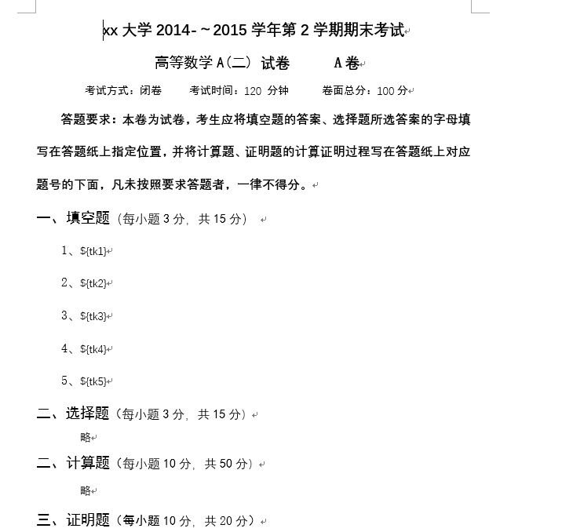
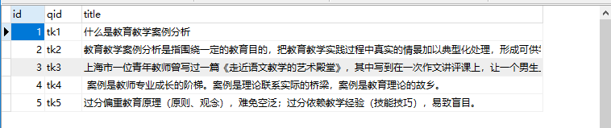
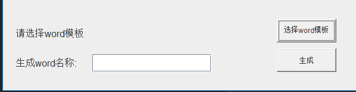
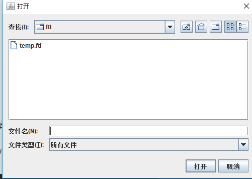
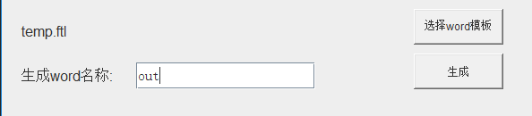
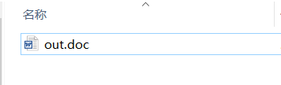
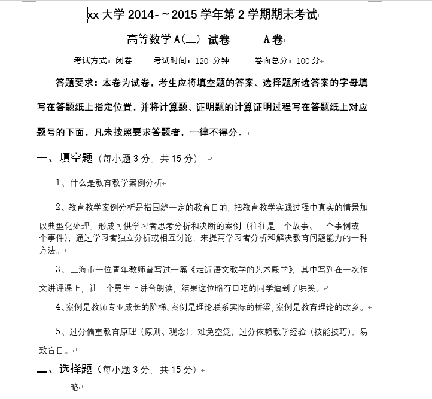
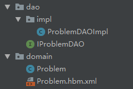

# java-word-MassProduction
依据word模板批量生成题库。

### 目录

* [使用方法](#使用方法)
* [开发流程](#开发流程)


### 一.使用方法

#### 1.制造题库所需Word模板



需要填充数据的地方使用 ${pid} 代替。

将这个word选择另存为,保存格式选择为xml，然后将这个xml放到项目的ftl目录下,后缀名改为.ftl 。

#### 2.配置数据库

项目中使用了hibernate，表结构可以自动生成，但前提得先有mysql数据库环境且创建好数据库，数据库连接信息可以在hibernate.hbm.xml中修改。

对应上面模板实例中的${pid}值,在对应数据库中选择题目写入。



#### 3.运行程序

在程序中选择要使用的word模板.





写入输出的word名称.



点击生成后,在项目word目录下：






当然也可以在数据库中导入大量题目，在导入时随机选择题目,然后对应相应的pid生成模板。


### 二.开发流程

#### 1.题目模型

数据库使用了hibernate，hibernate的相关知识不再做解释.



Problem中定义了一道题目的信息。
    
    id数据库主键索引.
    pid对应word模板的${id}.
    title对应了题目的内容。

IProblemDAO是一个接口,用来实现题目的增删改查.

```java
public interface IProblemDAO {
    void save(Problem problem);
    void update(Problem problem);
    void delete(Problem problem);
    Problem get(Integer id);
    List<Problem> listAll();
}
```

ProblemDAOImpl实现了IProblemDAO接口.
    
    hibernate的save,delete,update,get等不再阐述.


ProblemDAOImpl的实现中我们使用到的其实只有listAll()方法。至于其他的暂时用不到。

#### 2.Word生成

这里主要用到了一个叫freemarker的第三方包。

1.什么是FreeMarker？

	FreeMarker是一款模板引擎，一种开源的、基于模板的、用来生成/输出文本的通用工具。
	它不是面向最终用户的，不是Web应用框架，它是Java的一个类库，是Web应用框架中的一个实用的组件，是一款可以嵌入开发产品的一款应用程序。
	FreeMarker的设计是被用来生成HTML页面，尤其是通过基于实现了MVC模式的Servlet应用程序。
	使用MVC模式的动态网页的构思，使得你可以将前端设计从程序中分离出来，更加贴合java的各司其职的编程思想，使得代码更简洁且便于维护。
	尽管FreeMarker也有编程能力，但它也不像PHP那样的一种全面的编程语言。
	一般我们只使用FreeMarker的模板生成个文本来呈现早已准备好的数据，它仅仅来生成文本，它也非常适用于非 Web应用环境的开发。

	要注意的是，我们使用FreeMarker作为视图层组件，是为给如 Struts这样的 Model2框架提供现成的解决方案，已经在一定情况下提高页面的响应速度。

2.FreeMaker的作用：页面静态化
	
	a）JavaEEWeb 开发存在的问题：动态网页技术创建的网页相率低，需要把这些动态网页转换成静态网页，节省程序运行时间
	b）是不是把一个系统中所有的网页都进行静态化？   什么样的页面需要静态化？
		[1]不是，因为当一个页面静态化之后，所有的写操作都会造成巨大的资源调动，造成更多资源的浪费，
			所以我们只将一些修改几率不大或不会修改的页面静态化。
		[2]例：电子图书、商品详情信息....
	c）CMS系统（Content Manager System）  就是把动态网页静态化


##### 首先我们需要一个Map，其中是模板中 ${pid}的pid值与题目内容。
    
    Map<String,String> dataMap = new HashMap<String,String>();
   
##### 读取模板ftl内容,ftl的格式规范其实是xml，所以我们使用Configuration用于读取ftl文件。
        Configuration configuration = new Configuration();
        configuration.setDefaultEncoding("utf-8");
        configuration.setDirectoryForTemplateLoading(new File("src\\main\\java\\ftl\\"));
 
##### 获取ftl的Template。
        Template t =  configuration.getTemplate(templateFileName,"utf-8");

##### 利用Map替换模板内容
        Writer out = new BufferedWriter(new OutputStreamWriter(new FileOutputStream("src\\main\\java\\word\\"+outFile+".doc"), "utf-8"),10240);
        t.process(dataMap, out);
